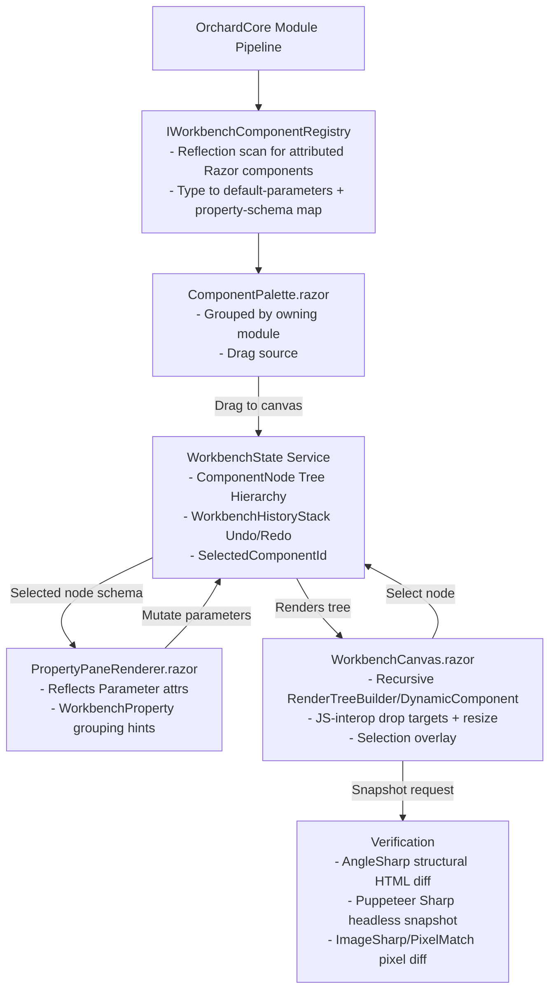

# Blazor Component Workbench & WYSIWYG Editor

**Status: not started.** This is a stored plan only — nothing here has been implemented.
A self-owned Component Workbench & WYSIWYG design surface, native to OrchardCore/Blazor,
using Appsmith's widget/canvas/layout architecture as the model — reimplemented for
Blazor's `RenderFragment`/component-parameter model in place of Appsmith's
React/Redux/DSL-JSON model. The routing registry it builds on is documented in
[blazor-web.md](blazor-web.md) ("Route reachability").

Originally captured in response to "is there a storybook and chromium addon equivalent
for C# Blazor components?" (no permissive-license equivalent exists). Uses [appsmithorg/appsmith](https://github.com/appsmithorg/appsmith)
(cloned locally to `/workspaces/appsmith`, Apache 2.0) as the reference architecture for
the UI/editor/canvas layer, ported to Blazor's component model instead of reimplemented
from scratch. Appsmith is a low-code app builder: drag-and-drop widget canvas, a widget
property/style panel, a layout engine, and a page/app IDE shell — functionally the same
shape as the "component workbench" this plan already wanted, and a mature, battle-tested
implementation of it. License is Apache 2.0 (permissive, attribution required) — safe to
port from with a `NOTICE`/attribution entry once implementation starts.

Verification (structural + pixel snapshotting) stays in the
same spirit as the Playwright screenshot-diff harness already built under
`modules/Crest/tests/playwright/harness/`.

## Phase 0: Study pass (Day 0)

### §1. What Appsmith gives us to port (source reference)

Reference paths below are all under `/workspaces/appsmith/app/client/src/` unless noted.

| Appsmith concept | Location | Blazor port target |
|---|---|---|
| Widget base class (`BaseWidget.tsx`) — every widget's common prop contract (position, size, `widgetId`, `parentId`, style config) | `widgets/BaseWidget.tsx` | `WorkbenchComponentBase` — a Blazor base component every registered component wraps, carrying `Id`, `ParentId`, `Position`, `Size`, `StyleConfig` |
| Widget registry/factory (how a widget type name resolves to a React component + default props + property-pane schema) | `WidgetProvider/` | `IWorkbenchComponentRegistry` — reflection-based scan of OrchardCore module assemblies for `[WorkbenchComponent]`-attributed Razor components, analogous to how Appsmith's registry maps a `type` string to a factory |
| Canvas rendering + drop targets + resize handles | `layoutSystems/common/canvasViewer/`, `layoutSystems/common/dropTarget/`, `layoutSystems/common/resizer/` | `WorkbenchCanvas.razor` — recursive tree renderer using `RenderTreeBuilder`/`DynamicComponent`, with JS-interop-backed drop targets and resize handles (Blazor has no native HTML5 drag/drop bridge to C# state, so this stays JS-interop like Appsmith's own DOM-level drag logic — nothing to "port" here except behavior, not code) |
| Fixed vs. responsive/auto layout systems (three interchangeable layout engines) | `layoutSystems/fixedlayout/`, `layoutSystems/autolayout/`, `layoutSystems/anvil/` | Start with the fixed-layout system only (`fixedlayout/` is the simplest — explicit x/y/w/h grid positions, no flex reflow math). Auto-layout/Anvil are v2 stretch goals — do not port their reflow algorithms into v1 |
| Selection/highlight overlays on the currently-selected widget | `layoutSystems/common/widgetComponent/`, editor selection sagas (`sagas/WidgetSelectionSagas.ts`) | Border-overlay directive driven by a `SelectedComponentId` field on workbench state, same visual behavior, no Redux — plain Blazor cascading state |
| Property/style pane (right-hand "knobs" panel driven by a per-widget property schema) | `PluginActionEditor/`, widget-specific `*.editor.ts`/property-pane config files colocated per widget folder | `PropertyPaneRenderer.razor` reflecting a component's public `[Parameter]`s (+ an optional `[WorkbenchProperty(Group, Editor)]` attribute for grouping/control-type hints) instead of Appsmith's hand-authored JSON property-pane schema per widget |
| IDE shell (page list, top bar, canvas, property pane composed together) | `IDE/Components/`, `IDE/Structure/` | `WorkbenchShell.razor` — top-level page composing palette + canvas + property pane, modeled 1:1 on `IDE/Structure`'s layout regions |
| Widget catalog/toolbox (draggable palette of available widget types) | `pages/Editor` widget sidebar, `WidgetQueryGenerators/` | `ComponentPalette.razor` — lists everything the registry discovers, grouped by module of origin |
| Undo/redo | Redux-based, `sagas/` action history | A dedicated `WorkbenchHistoryStack` service (command-pattern mutation log), since Blazor has no Redux equivalent to lean on — this is new code, not a port, but same *behavior contract* as Appsmith's |

**Deliberately not porting (v1):** Appsmith's JS/Python query-datasource system
(`PluginActionEditor`, `Datasource/`), its Git-backed app versioning (`git/`,
`git-artifact-helpers/`), and the Anvil/auto-layout reflow engines. These solve problems
(remote data binding, app-level version control, responsive reflow) this plan doesn't need
yet — OrchardCore already has its own content/data layer and this workbench is scoped to
component layout/preview only. Revisit only if a concrete need shows up.

### Study items

- [ ] **Read the widget contract.** Read `widgets/BaseWidget.tsx`, `WidgetProvider/`, and one concrete simple widget end
  to end (`widgets/ButtonWidget/` is the smallest complete example) to confirm the
  prop/registry contract before writing `WorkbenchComponentBase`.
- [ ] **Read the fixed layout system.** Read `layoutSystems/fixedlayout/` (editor + canvas + common) end to end — this is the
  only layout system being ported in v1.
- [ ] **Scope drag/drop and resize.** Read `layoutSystems/common/dropTarget/` and `layoutSystems/common/resizer/` to scope
  exactly what JS interop needs to replicate (drag-over detection, ghost preview, resize
  handle hit-testing) versus what's pure React state that has no DOM analog to port.

## Phase 1: Core Engine & State Foundation

Goal: a thread-safe, multi-tenant state container capable of compiling component nodes
into living DOM interfaces, modeled on Appsmith's widget-tree + registry split.

### §2. System Architecture



### §3. Core Data Models (`OrchardCore.Module.Workbench.Core`)

- [ ] **Build `IWorkbenchComponentRegistry` on the routing registry's plumbing (§0, §3c).** Build `IWorkbenchComponentRegistry`: reflection scan of loaded module assemblies for
  `[WorkbenchComponent]`-attributed Razor components at OrchardCore startup, producing a
  `type name -> (Type, default ComponentNode, property schema)` map, analogous to
  `WidgetProvider/`'s registry.
  - Sub-task: only scan module assemblies within the same trust boundary as
    `modules/Crest/` and this workbench module itself. **Never auto-register
    third-party/vendored assemblies** (e.g. `OrchardCore.Commerce`'s vendored subtree,
    see [[project-crest-test-plan]]'s note on that project's separate upstream/CI) without
    an explicit opt-in list.

  Component Registration Attribute:

  ```csharp
  [AttributeUsage(AttributeTargets.Class, AllowMultiple = false)]
  public sealed class WorkbenchComponentAttribute : Attribute
  {
      public string DisplayName { get; init; } = string.Empty;
      public string Group { get; init; } = "General"; // palette grouping, mirrors Appsmith widget categories
  }

  [AttributeUsage(AttributeTargets.Property, AllowMultiple = false)]
  public sealed class WorkbenchPropertyAttribute : Attribute
  {
      public string Group { get; init; } = "Content"; // e.g. Content / Style / Layout, mirrors Appsmith's property-pane tabs
      public string? Editor { get; init; } // hint for PropertyPaneRenderer's control-type selection
  }
  ```

  **§0. What's available from the routing implementation ([docs/blazor-web.md](blazor-web.md))**

  Site/Admin's routing-reachability fix (`RouteComponentTable`/`IRouteComponentTableProvider`) has shipped and is documented in [docs/blazor-web.md](blazor-web.md)'s "Route reachability" section. Record here, concretely, what that leaves behind for this plan to build on.

  **`RouteComponentTable` and `IRouteComponentTableProvider`** (`Crest.Server/Routing/`, documented in `docs/blazor-web.md`) — a per-tenant, per-active-theme, convention-scanned registry mapping a route pattern to a Blazor component `Type`, built once per shell (mirroring `DefaultShapeTableManager`/`ShapeTable`'s cache-per-`themeId` shape) and invalidated on shell/feature/theme change, never rebuilt per request. Each Blazor theme (Admin, Site, and this workbench once it exists) supplies its own `IRouteComponentTableProvider`, self-reporting its own `@page`-attributed components via reflection — nobody hand-maintains a central route list.

  **Why this matters for the workbench specifically:** this document's §3's `IWorkbenchComponentRegistry` (reflection scan of `[WorkbenchComponent]`-attributed Razor components, `type name -> (Type, default ComponentNode, property schema)` map) is architecturally the *same* primitive as `IRouteComponentTableProvider` (reflection scan of `@page`-attributed Razor components, `route pattern -> Type` map) — both are "convention-scanned, theme/shell-scoped, Orchard-native registry," just keyed differently (component type name vs. route pattern) and serving different consumers (canvas palette vs. HTTP routing). **Do not build `IWorkbenchComponentRegistry` as an unrelated, parallel mechanism.**

  - **Reuse the scanning/caching infrastructure, not just the pattern.** `AdminRouteComponentTableProvider` and `SiteRouteComponentTableProvider` (`Crest.Server/Routing/AssemblyRouteComponentScanner.cs`) are already two consumers of the same scan logic before the workbench is even a third — `AssemblyScanningWorkbenchComponentRegistry` should factor out and reuse a shared "scan these assemblies for components carrying attribute `TAttribute`, cache per shell, invalidate on theme/feature change" helper with `WorkbenchComponentAttribute`, instead of duplicating the scan/cache logic from scratch.
  - **`WorkbenchComponentAttribute` and any future `[RouteComponent]`-style marker (if `@page` itself isn't judged sufficient as the routing implementation's registration point) should be designed to coexist on the same component class.** A component usable both as a routable page *and* a placeable workbench widget is a real, expected case (e.g. `CrestCounter`, already both a `[CrestBlazorComponent]`-marked shape-pipeline component *and* a routable `@page "/blazor-counter/{ContentItemId}"` island) — the two attributes are orthogonal facts about the same type, not competing registration systems.
  - **Theme/shell scoping is inherited for free.** Because the workbench's own registry follows the same per-shell-cache shape as `RouteComponentTable`, a tenant with the workbench feature disabled simply has an empty/absent registry — no separate feature-gating logic needs inventing for "is the workbench available on this tenant," it falls out of the same `IShellFeaturesManager`-driven invalidation `RouteComponentTable` already uses.
  - **No invented literals here either.** `IWorkbenchComponentRegistry`'s `type name -> Type` keys must come from the same place `RouteComponentTable`'s route patterns do — the attribute/reflection scan itself — never a hand-typed registration list in a `Startup.cs`. This plan already designed it this way (§3c); this section exists to make explicit that the routing implementation is not just a *precedent* for that design, it's the literal shared plumbing to build it on top of.

  **What is NOT shared:** `ComponentNode`'s tenant-editable tree persistence (§3, `CrestBlazorComponentPart`) and `RouteComponentTable`'s routing gate are unrelated at the data layer — a workbench-placed component instance is content (a `ContentItem`), not a route. The shared piece is strictly the *discovery* mechanism (how a component `Type` gets found and cached per tenant), not anything about where instances of it live or how they're addressed.

- [ ] **Build `WorkbenchState` and the `ComponentNode` tree (§3).** Build `WorkbenchState` (scoped DI service, one per editor session/tenant) — the
  `ComponentNode` tree, `SelectedComponentId`, and a `WorkbenchHistoryStack` for undo/redo.

  Component Tree Node:

  ```csharp
  namespace OrchardCore.Module.Workbench.Core;

  public class ComponentNode
  {
      public Guid Id { get; set; } = Guid.NewGuid();
      public Guid? ParentId { get; set; }
      public string ComponentTypeFullName { get; set; } = string.Empty;

      // Fixed-layout position/size, mirrors Appsmith's fixedlayout grid fields
      // (topRow/leftColumn/bottomRow/rightColumn) collapsed to a simpler rect.
      public int Row { get; set; }
      public int Column { get; set; }
      public int RowSpan { get; set; } = 1;
      public int ColumnSpan { get; set; } = 1;

      // Tracks [Parameter] values modified via the property pane.
      public Dictionary<string, object?> Parameters { get; set; } = new(StringComparer.Ordinal);

      public List<ComponentNode> Children { get; set; } = new();
  }
  ```

- [ ] **Build the canvas render step.** Build `WorkbenchCanvas.razor`'s recursive render step using `RenderTreeBuilder` (or
  `DynamicComponent` if parameter binding proves simpler that way) to instantiate each
  node's resolved `Type` with its `Parameters` dictionary.

## Phase 2: User Interface Design Studio

Goal: reproduce Appsmith's editor shell layout and interaction model, ported to Blazor.

- [ ] **Build the workbench shell.** Build `WorkbenchShell.razor` composing `ComponentPalette` (left) / `WorkbenchCanvas`
  (center) / `PropertyPaneRenderer` (right), matching `IDE/Structure`'s region layout.
- [ ] **Build the component palette.** Build `ComponentPalette.razor` listing registry entries grouped by
  `WorkbenchComponentAttribute.Group`, matching Appsmith's widget-category sidebar.
- [ ] **Implement drag, reposition and resize.** Implement JS-interop drag-from-palette + drag-to-reposition + resize handles, scoped
  to what Phase 0's read of `dropTarget`/`resizer` found necessary — expect this to be new
  JS interop code with the *same behavior contract* as Appsmith's DOM logic, not a literal
  code port (Appsmith's drag/drop is deeply wired into React's synthetic event system and
  Redux dispatch, neither of which exists in Blazor).
- [ ] **Implement selection overlays.** Implement selection border overlays driven by `WorkbenchState.SelectedComponentId`.
- [ ] **Build the property pane.** Build `PropertyPaneRenderer.razor`: reflect the selected node's `Type` for public
  `[Parameter]` properties (+ `[WorkbenchProperty]` hints for grouping/editor control type),
  rendering an appropriate input per CLR type (string → text box, bool → checkbox, enum →
  dropdown, etc.), writing back into `ComponentNode.Parameters` on change.
- [ ] **Add the Appsmith `NOTICE` entry.** **Attribution requirement:** since the widget/registry/canvas/property-pane *design* is
  ported from Appsmith (Apache 2.0), add a `NOTICE` entry crediting appsmithorg/appsmith
  once any of the Phase 1–2 components land, even though no literal source is copied
  (TypeScript/React → C#/Razor is a redesign, not a transliteration) — attribution is the
  safer read of Apache 2.0 §4 for a derived-architecture situation like this.

## Phase 3: Headless Verification Engine

Goal: verification without external web hooks or heavy runtime overhead, same spirit as
the existing Playwright screenshot-diff harness but for Blazor component output.

### §5. Technical Specifications & Dependencies

| Dependency | Purpose | License | Tier |
|---|---|---|---|
| AngleSharp | Normalizes structural HTML trees for DOM validation | MIT | Core |
| Puppeteer Sharp | Spins up Chromium viewports for pixel snapshotting | MIT | Optional/Engine |
| System.Text.Json | Serializes the active workspace tree to clear text | MIT / Native | Core |
| (reference only, not a runtime dependency) appsmithorg/appsmith | Architecture/UX reference for widget registry, canvas, property pane, IDE shell | Apache 2.0 | Reference |

### Snapshot & System Manifest

```csharp
public class DesignSnapshot
{
    public Guid Id { get; set; } = Guid.NewGuid();
    public string Name { get; set; } = string.Empty;
    public DateTime CreatedUtc { get; set; } = DateTime.UtcNow;
    public string StateTreeJson { get; set; } = string.Empty;
    public string StructuralHtmlHash { get; set; } = string.Empty;
    public byte[]? CapturedScreenshotPng { get; set; }
}
```

### Verification items

- [ ] **Normalize structural HTML with AngleSharp.** Pull in AngleSharp (MIT) to strip runtime tokens (Blazor's `_bl_*` marker attributes,
  auto-generated element IDs) and compile static layout trees to predictable raw text
  signatures.
- [ ] **Record canvas snapshots with Puppeteer Sharp.** Integrate Puppeteer Sharp (MIT) into an isolated OrchardCore background task running
  local Chromium targets to record canvas renderings into baseline binaries — same
  base/new/`UPDATE_BASE=1` promotion convention as
  `modules/Crest/tests/playwright/harness/screenshot-diff.js`, for consistency
  across both harnesses.
- [ ] **Write or adopt the image-difference processor.** Write a deterministic image-difference processor using standard mathematical color
  delta loops (`dE = sqrt((r1-r2)^2 + (g1-g2)^2 + (b1-b2)^2)`), or evaluate reusing
  `Verify.XunitV3`'s image-comparison support (see
  [[project-crest-test-stack]]) instead of hand-rolling this — check before Phase 3 starts
  whether Verify already covers this well enough to drop the custom delta loop.

## Phase 4: Convert an existing Crest component as the pilot

- [ ] **Register a real Crest component as the pilot.** Pick one real, already-built Crest component (a good candidate: something in
  `modules/Crest/Crest.Components/`) and register it via
  `[WorkbenchComponent]` as the first end-to-end proof — palette → canvas → property pane
  → snapshot, no synthetic test-only component.

## §6. Verification & Testing Matrix

- [ ] **State Mutation Stability.**
  - Test case: changing a single integer parameter input field in the property pane.
  - Success metric: `WorkbenchState` updates only that component node without resetting
    child layout states or wiping structural attributes.
- [ ] **Structural Snapshot Precision.**
  - Test case: injecting a Blazor component with shifting `_bl_*`/GUID attributes into the
    rendering loop.
  - Success metric: the AngleSharp validation process clears out non-deterministic string
    values, emitting matching HTML string outputs across subsequent renders.
- [ ] **Pixel-Perfect Contrast Processing.**
  - Test case: running a visual delta scan between two baseline component images
    containing a 3px color boundary offset.
  - Success metric: the mathematical loop (or `Verify.XunitV3`'s image comparer, if adopted
    in Phase 3) catches the exact color difference, flags the item as failed, and calculates
    a precise error ratio (e.g. 0.0015%).
