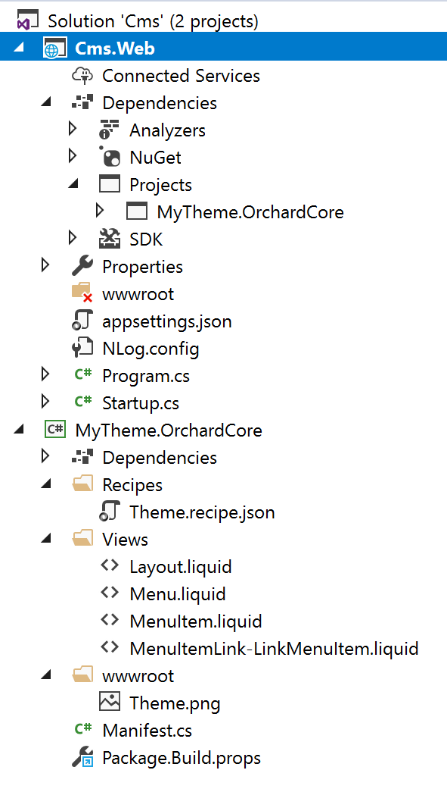

# Getting started with an Crest Theme

In this article, we are going to create an Crest Theme by adding it to an existing Crest CMS application [created previously](README.md).

## Create an Crest Theme

- Install the [Code Generation Templates](templates/README.md)
- Create a folder alongside (*not* within) the application folder created before, with the name of your theme (Ex: `MyTheme.Crest`). Preferably create a new folder under `Crest.Themes` directory. Open it. We are going to create a new project in this folder.
- Execute the command `dotnet new octheme`
- In Visual Studio, add the newly created theme project to the solution, then add a reference to the project from the main Crest CMS Web application.
- In Visual Studio Code or CLI, execute the command `dotnet sln add MyTheme.Crest.csproj` to add project to solution. Then, go to `Crest.Cms.Web` folder and execute the command `dotnet add Crest.Cms.Web.csproj reference ../Crest.Themes/MyTheme.Crest.csproj`
- Set the main Crest CMS Web application as the startup project.

 - The Admin UI can utilize a thumbnail by incorporating a `wwwroot\Theme.png` file within the root folder of the theme project.



The properties of the theme can be changed in the __Manifest.cs__ file:

```csharp
using Crest.DisplayManagement.Manifest;

[assembly: Theme(
    Name = "MyTheme",
    Author = "My name",
    Website = "https://mywebsite.net",
    Version = "0.0.1",
    Description = "My Crest Theme description."
)]
```

The theme should be available in the `Active themes` admin page, and can be set as the default theme.

## How to enable Razor templates in my theme?

The themes we have in source code use only `Liquid` files, so their .csproj files only reference:

`<Project Sdk="Microsoft.NET.Sdk">`

If you want to use Razor templates in your theme, you simply need to change this .csproj first line to:

`<Project Sdk="Microsoft.NET.Sdk.Razor">`
