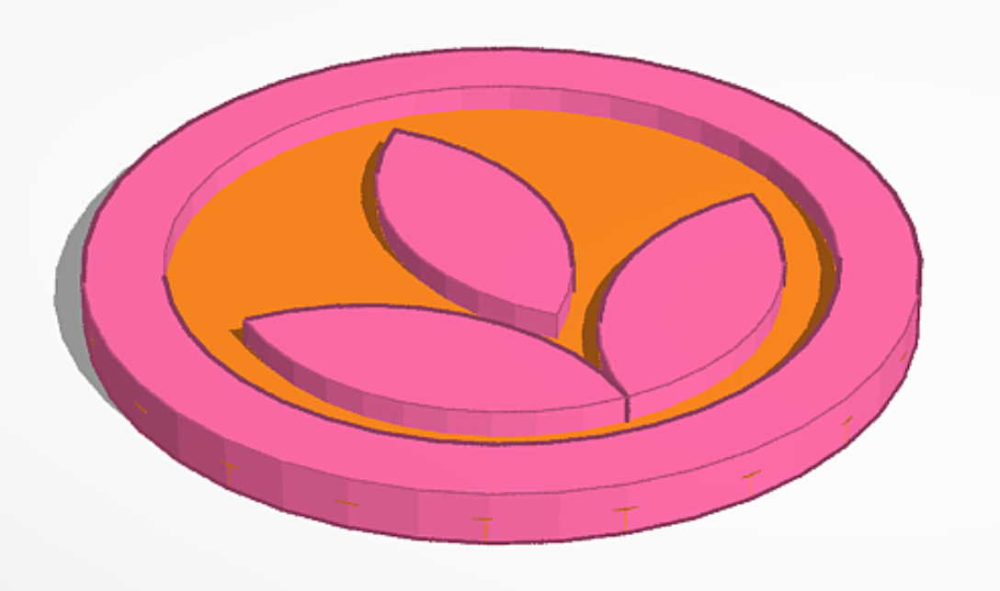

# Crest Branding

Here you can find some guidelines and graphic assets for Crest's branding.

# Branding Guidelines

When referring to Crest, please use one of the logo variations, without altering anything apart from the resolution (so don't change the colors, aspect ratio, graphics, or anything else). For further information on how to use these assets and colors, see the [Branding Guidelines (PDF)](assets/platform-core-branding-guidelines.pdf) (and [here's the AI version](assets/platform-core-branding-guidelines.ai)).

# Logo Variations

## Color Logo

Other formats:

- [AI](assets/logo/color/platform-core-logo-color.ai)
- [PDF](assets/logo/color/platform-core-logo-color.pdf)
- [PNG, high-resolution](assets/logo/color/platform-core-logo-color-high-resolution.png)
- [SVG](assets/logo/color/platform-core-logo-color.svg)

## Dark Logo

Other formats:

- [AI](assets/logo/dark/platform-core-logo-dark.ai)
- [PDF](assets/logo/dark/platform-core-logo-dark.pdf)
- [PNG, high-resolution](assets/logo/dark/platform-core-logo-dark-high-resolution.png)
- [SVG](assets/logo/dark/platform-core-logo-dark.svg)

## Light Logo

The background of this logo in the display below is set to black so it's actually visible, but otherwise it has a transparent background.

Other formats:

- [AI](assets/logo/light/platform-core-logo-light.ai)
- [PDF](assets/logo/light/platform-core-logo-light.pdf)
- [PNG, high-resolution](assets/logo/light/platform-core-logo-light-high-resolution.png)
- [SVG](assets/logo/light/platform-core-logo-light.svg)

## Color Symbol Logo

Other formats:

- [AI](assets/logo/symbol/color/platform-core-symbol-logo-color.ai)
- [PDF](assets/logo/symbol/color/platform-core-symbol-logo-color.pdf)
- [SVG](assets/logo/symbol/color/platform-core-symbol-logo-color.svg)

## Dark Symbol Logo

Other formats:

- [AI](assets/logo/symbol/dark/platform-core-symbol-logo-dark.ai)
- [PDF](assets/logo/symbol/dark/platform-core-symbol-logo-dark.pdf)
- [SVG](assets/logo/symbol/dark/platform-core-symbol-logo-dark.svg)

## Light Symbol Logo

The background of this logo in the display below is set to black so it's actually visible, but otherwise it has a transparent background.

Other formats:

- [AI](assets/logo/symbol/light/platform-core-symbol-logo-light.ai)
- [PDF](assets/logo/symbol/light/platform-core-symbol-logo-light.pdf)
- [SVG](assets/logo/symbol/light/platform-core-symbol-logo-light.svg)

# Printable 3D Logo

A printable 3D model of the Crest symbol logo is available below.

- [STL](assets/stl/PlatformLogo3D.stl)
- [Orca Slicer project file](assets/stl/PlatformLogo3D.3mf) that contains the model with colored surfaces.

# Fonts

We use the [Open Sans font family](https://fonts.google.com/specimen/Open+Sans). You can find all the font files in [the `assets/fonts` folder](https://github.com/OrchardCMS/OrchardCore/tree/main/src/docs/reference/branding/assets/fonts) of this documentation page. Be sure to adhere to [the font's license](assets/fonts/LICENSE.txt).

# Screensaver

Displays a bouncing (DVD-style) Crest logo, with the logo being encoded into the file, i.e. it is self-contained and offline-compatible. Double-clicking anywhere displays a dialog to set up (or remove) a countdown in the middle of the screen.

- [Crest Screensaver with Countdown](assets/platform-core-screensaver.html)
