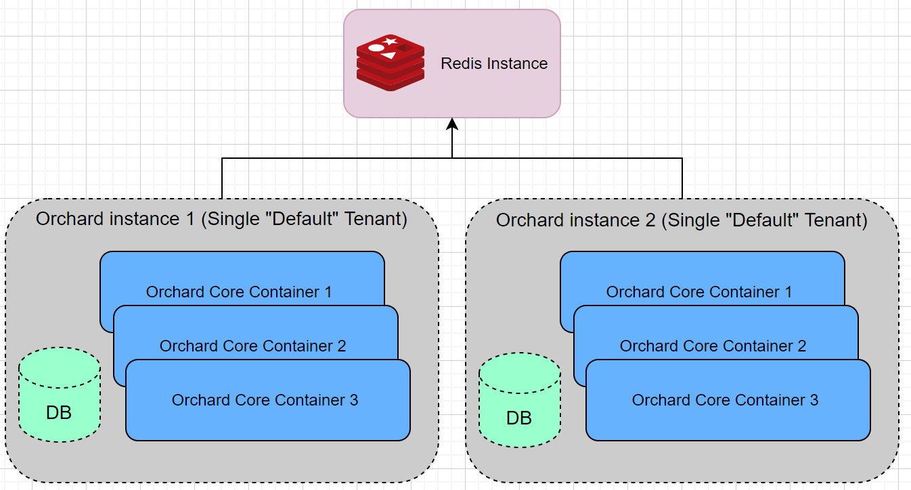

# Auto Setup (`Crest.AutoSetup`)

The auto-setup module allows to automatically install the application/tenants on the first request.

## JSON Configuration Parameters

Auto-Setup parameters are defined in `appsettings.json`. Example excerpt:

```json
{
  "Crest": {
    "Crest_AutoSetup": {
      "AutoSetupPath": "",
      "Tenants": [
        {
          "ShellName": "Default",
          "SiteName": "AutoSetup Example",
          "SiteTimeZone": "Europe/Amsterdam",
          "AdminUsername": "admin",
          "AdminEmail": "info@orchardproject.net",
          "AdminPassword": "PlatformRules1!",
          "DatabaseProvider": "Sqlite",
          "DatabaseConnectionString": "",
          "DatabaseTablePrefix": "",
          "RecipeName": "SaaS"
        },
        {
          "ShellName": "AutoSetupTenant",
          "SiteName": "AutoSetup Tenant",
          "SiteTimeZone": "Europe/Amsterdam",
          "AdminUsername": "tenantadmin",
          "AdminEmail": "tenant@orchardproject.net",
          "AdminPassword": "PlatformRules1!",
          "DatabaseProvider": "Sqlite",
          "DatabaseConnectionString": "",
          "DatabaseTablePrefix": "tenant",
          "RecipeName": "Agency",
          "RequestUrlHost": "",
          "RequestUrlPrefix": "tenant",
          "FeatureProfile": "my-profile"
        }
      ]
    }
  }
}
```

| Parameter       | Description                                                                                                                         |
|-----------------|-------------------------------------------------------------------------------------------------------------------------------------|
| `AutoSetupPath` | The URL to trigger AutoSetup for each tenant. If empty, auto-setup will be triggered on the first tenant request, e.g. `/`, `/tenant-prefix` |
| `Tenants`       | The list of the tenants to install.                                                                                                 |

| Parameter                  | Description                                                                                                                                                                                                               |
|----------------------------|---------------------------------------------------------------------------------------------------------------------------------------------------------------------------------------------------------------------------|
| `ShellName`                | The technical shell / tenant name. It cannot be empty and must contain characters only. Use "Default" for the default tenant.                                                                                            |
| `SiteName`                 | The name of the site.                                                                                                                                                                                                     |
| `AdminUsername`            | The tenant username of the super user.                                                                                                                                                                                    |
| `AdminEmail`               | The email of the tenant super user.                                                                                                                                                                                       |
| `AdminPassword`            | The password of the tenant super user.                                                                                                                                                                                    |
| `DatabaseProvider`         | The database provider.                                                                                                                                                                                                    |
| `DatabaseConnectionString` | The connection string.                                                                                                                                                                                                    |
| `DatabaseTablePrefix`      | The database table prefix. Can be used to install a tenant on the same database.                                                                                                                                          |
| `RecipeName`               | The tenant installation Recipe name.                                                                                                                                                                                      |
| `RequestUrlHost`           | The tenant host URL.                                                                                                                                                                                                      |
| `RequestUrlPrefix`         | The tenant URL prefix.                                                                                                                                                                                                    |
| `FeatureProfile`           | Optionally, the name of the feature profile used by default. Only applicable if the "Feature Profiles" feature is used. See the [documentation of the Tenants module](../Tenants/README.md#feature-profiles) for details. |

!!! note
    Tenants array must contain the root tenant with `ShellName` equal to `Default`.
    Each tenant will be installed on demand (on the first tenant request).  
    If AutoSetupPath is provided, it must be used to trigger the installation for each tenant, e.g.:
    `/autosetup` - trigger installation of the Root tenant.
    `/mytenant/autosetup` - auto-install mytenant.

### User Secrets and Environment Variables

If your JSON configuration contains sensitive information, or you don't want to commit it to the repository (because e.g. Auto Setup is not utilized by the whole development team), it is recommended to use user secrets or environment variables instead.

[User secrets](https://learn.microsoft.com/en-us/aspnet/core/security/app-secrets#secret-manager) are available during local development, and they are stored as JSON files. This means you can move the whole configuration from `appsettings.json` as-is. Alternatively, you can set each option directly from the command line (this will flatten any existing structures in the `secrets.json` file):

```shell
cd src/Crest.Cms.Web
dotnet user-secrets init
dotnet user-secrets set "Crest:Crest_AutoSetup:Tenants:0:ShellName" "Default"
dotnet user-secrets set "Crest:Crest_AutoSetup:Tenants:0:SiteName" "AutoSetup Example"
dotnet user-secrets set "Crest:Crest_AutoSetup:Tenants:0:SiteTimeZone" "Europe/Amsterdam"
dotnet user-secrets set "Crest:Crest_AutoSetup:Tenants:0:AdminUsername" "admin"
dotnet user-secrets set "Crest:Crest_AutoSetup:Tenants:0:AdminEmail" "info@orchardproject.net"
dotnet user-secrets set "Crest:Crest_AutoSetup:Tenants:0:AdminPassword" "PlatformRules1!"
dotnet user-secrets set "Crest:Crest_AutoSetup:Tenants:0:RecipeName" "SaaS"
dotnet user-secrets set "Crest:Crest_AutoSetup:Tenants:0:DatabaseProvider" "Sqlite"
```

If you use a setup like the above when working with the full source code of Crest, then all copies of the source will use it, due to `Crest.Cms.Web` having `UserSecretsId` pre-configured. This is really useful when contributing to Crest. However, if you want to remove this functionality, just remove the `UserSecretsId` element from the given copy's `Crest.Cms.Web.csproj`.

[Environment variables](https://learn.microsoft.com/en-us/aspnet/core/fundamentals/configuration#non-prefixed-environment-variables) are available on both server and local machine. But if you have multiple projects, you have to prefix them to avoid clashes.

```
"Crest__Crest_AutoSetup__AutoSetupPath": ""

"Crest__Crest_AutoSetup__Tenants__0__ShellName": "Default"
"Crest__Crest_AutoSetup__Tenants__0__SiteName": "AutoSetup Example"
"Crest__Crest_AutoSetup__Tenants__0__SiteTimeZone": "Europe/Amsterdam"
"Crest__Crest_AutoSetup__Tenants__0__AdminUsername": "admin"
"Crest__Crest_AutoSetup__Tenants__0__AdminEmail": "info@orchardproject.net"
"Crest__Crest_AutoSetup__Tenants__0__AdminPassword": "PlatformRules1!"
"Crest__Crest_AutoSetup__Tenants__0__DatabaseProvider": "Sqlite"
"Crest__Crest_AutoSetup__Tenants__0__DatabaseConnectionString": ""
"Crest__Crest_AutoSetup__Tenants__0__DatabaseTablePrefix": ""
"Crest__Crest_AutoSetup__Tenants__0__RecipeName": "SaaS"

"Crest__Crest_AutoSetup__Tenants__1__ShellName": "AutoSetupTenant"
"Crest__Crest_AutoSetup__Tenants__1__SiteName": "AutoSetup Tenant"
"Crest__Crest_AutoSetup__Tenants__1__SiteTimeZone": "Europe/Amsterdam"
"Crest__Crest_AutoSetup__Tenants__1__AdminUsername": "tenantadmin"
"Crest__Crest_AutoSetup__Tenants__1__AdminEmail": "tenant@orchardproject.net"
"Crest__Crest_AutoSetup__Tenants__1__AdminPassword": "PlatformRules1!"
"Crest__Crest_AutoSetup__Tenants__1__DatabaseProvider": "Sqlite"
"Crest__Crest_AutoSetup__Tenants__1__DatabaseConnectionString": ""
"Crest__Crest_AutoSetup__Tenants__1__DatabaseTablePrefix": ""
"Crest__Crest_AutoSetup__Tenants__1__RecipeName": "Agency"
"Crest__Crest_AutoSetup__Tenants__1__RequestUrlHost": ""
"Crest__Crest_AutoSetup__Tenants__1__RequestUrlPrefix": "tenant"
```

For testing purposes, you may add the above environment variables into a "web" profile in the launchSettings.json file of the Crest.Cms.Web project.  
Then, start the web app project with the following command:

```
dotnet run --launch-profile web
```

## Enabling Auto Setup Feature

To enable the Auto Setup feature, it is necessary to add it in the Web project's Startup file:

```csharp
    public void ConfigureServices(IServiceCollection services)
    {
        services
            .AddPlatformCms()
            .AddSetupFeatures("Crest.AutoSetup");
    }
```

This feature is enabled by default in the default project included in the source code, but
is not with the application templates to prevent any unexpected behavior when a custom project
is created.

## Using Distributed Lock For Auto Setup

If multiple Crest instances sharing the same database are launched, you might need a distributed lock for an atomic auto setup.

You should enable the Redis Lock feature in the startup file.

```csharp
    public void ConfigureServices(IServiceCollection services)
    {
        services
            .AddPlatformCms()
            .AddSetupFeatures("Crest.Redis.Lock", "Crest.AutoSetup");
    }
```

Make sure you set the Redis configuration string via an environment variable or a configuration file.

```
"Crest__Crest_Redis__Configuration": "192.168.99.100:6379,allowAdmin=true"
```

Optional Distributed Lock Parameters.

| Parameter | Description | Default Value |
| --- | --- |
| `LockTimeout` | The timeout in milliseconds to acquire a distributed auto setup lock. | 60 seconds |
| `LockExpiration` | The expiration in milliseconds of the distributed setup lock. | 60 seconds |

Lock configuration parameters are optional and can be set via environment variables or a configuration file.

```
"Crest__Crest_AutoSetup__LockOptions__LockTimeout": "10000"
"Crest__Crest_AutoSetup__LockOptions__LockExpiration": "10000"
```

## Additional information

Please refer to separate sections for additional information on setup:

- [Crest.Setup - setting up an empty site](../Setup/README.md)
